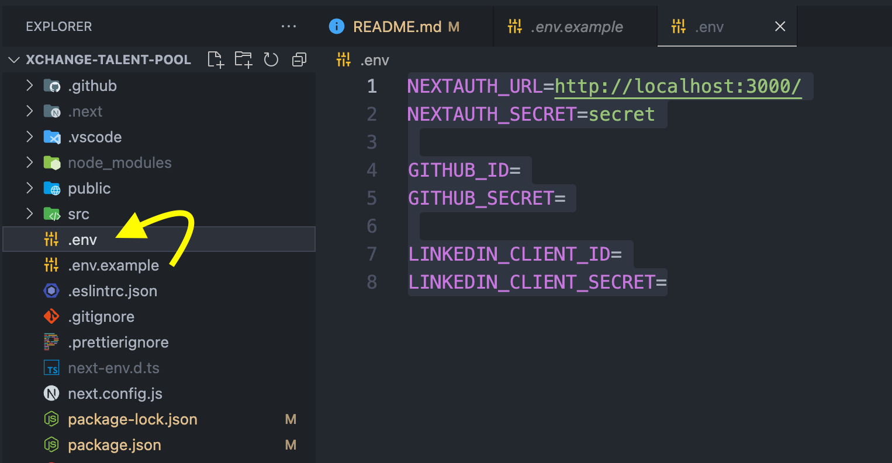

# XChange 人才庫

##### `updated: 2023/05/27`

## How to Start

1.  Install Packages

    ```shell
    npm install
    ```

2.  Create `.env` file from `.env.example` and Set the Env Variable

    

3.  Development

    ```shell
    npm run dev
    ```

## Tech Stack

| Package                                          | Description                            |
| ------------------------------------------------ | -------------------------------------- |
| [Next.js (App Routing)](https://nextjs.org/docs) | Base                                   |
| [Tailwind CSS](https://tailwindcss.com/)         | Styling                                |
| [NextAuth](https://next-auth.js.org/)            | Authentication                         |
| [FORMIK](https://formik.org/)                    | Form Handling                          |
| [yup](https://github.com/jquense/yup)            | Schema Validation with FORMIK          |
| [clsx](https://github.com/lukeed/clsx)           | Conditionally joining classes together |

## VSCode Recommend Extensions

| Package                                                                                                         | Description                               |
| --------------------------------------------------------------------------------------------------------------- | ----------------------------------------- |
| [ESLint](https://marketplace.visualstudio.com/items?itemName=dbaeumer.vscode-eslint)                            | Integrates ESLint JavaScript into VS Code |
| [Prettier](https://marketplace.visualstudio.com/items?itemName=esbenp.prettier-vscode)                          | Code formatter using prettier             |
| [Code Spell Checker](https://marketplace.visualstudio.com/items?itemName=streetsidesoftware.code-spell-checker) | Spelling checker for source code          |
| [TODO Highlight](https://marketplace.visualstudio.com/items?itemName=wayou.vscode-todo-highlight)               | Highlight TODOs, FIXMEs,and any keywords  |
